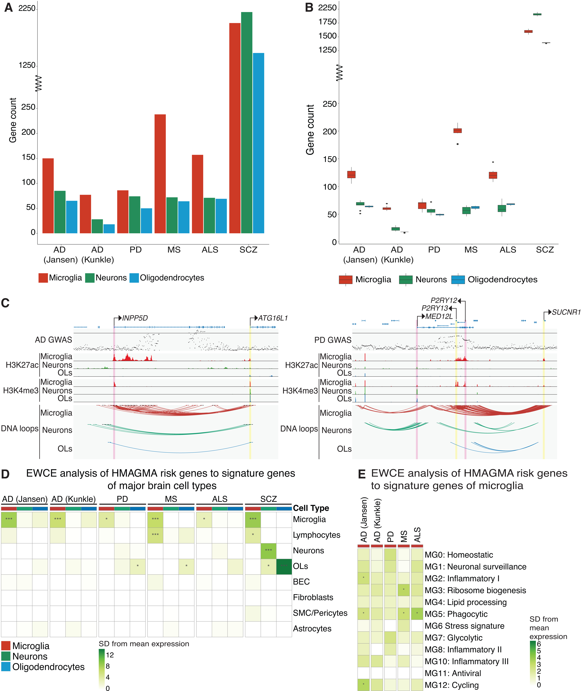

# Genetic risk for neurodegenerative conditions is linked to disease-specific microglial pathways

(https://journals.plos.org/plosgenetics/article?id=10.1371/journal.pgen.1011407)

**Aydan Askarova**<sup>1,2</sup>, **Reuben M. Yaa**<sup>1,2</sup>, **Sarah J. Marzi**<sup>3,4</sup> & **Alexi Nott**<sup>1,2</sup>

<sup>1</sup> Department of Brain Sciences, Imperial College London, London, UK
<sup>2</sup> UK Dementia Research Institute, Imperial College London, London, UK
<sup>3</sup> Department of Basic and Clinical Neuroscience, Institute of Psychiatry, Psychology and Neuroscience, King's College London, London, UK
<sup>4</sup> UK Dementia Research Institute, King's College London, London, UK

## Abstract

Genome-wide association studies have identified thousands of common variants associated with an increased risk of neurodegenerative disorders. However, the noncoding localization of these variants has made the assignment of target genes for brain cell types challenging. Genomic approaches that infer chromosomal 3D architecture can link noncoding risk variants and distal gene regulatory elements such as enhancers to gene promoters.

By using enhancer-to-promoter interactome maps for human microglia, neurons, and oligodendrocytes, we identified cell-type-specific enrichment of genetic heritability for brain disorders through stratified linkage disequilibrium score regression. Our analysis suggests that genetic heritability for multiple neurodegenerative disorders is enriched at microglial chromatin contact sites, while schizophrenia heritability is predominantly enriched at chromatin contact sites in neurons followed by oligodendrocytes.

Through Hi-C coupled multimarker analysis of genomic annotation (H-MAGMA), we identified disease risk genes for Alzheimer's disease, Parkinson's disease, multiple sclerosis, amyotrophic lateral sclerosis and schizophrenia. We found that disease-risk genes were overrepresented in microglia compared to other brain cell types across neurodegenerative conditions and within neurons for schizophrenia. Notably, the microglial risk genes and pathways identified were largely specific to each disease.

Our findings reinforce microglia as an important, genetically informed cell type for therapeutic interventions in neurodegenerative conditions and highlight potentially targetable disease-relevant pathways.

**Keywords:** epigenetics, disease-risk genes, chromatin interactions, neurodegeneration, microglia



## Repository structure

```
.
├── data/           Regulatory element and interactome inputs (ATAC-seq, H3K27Ac, H3K4me3,
│                   PLAC-seq, enhancers, promoters) per cell type; see data/DATASETS_SOURCES.md
│                   for provenance of these and the GWAS summary statistics used.
├── hmagma/scripts/ H-MAGMA annotation file generation, gene-level MAGMA analysis, and
│                   downstream pathway/enrichment analysis (EWCE, statistical tests).
└── ldsc/           Stratified LD score regression: annotation file generation, heritability
    ├── scripts/    enrichment analysis, and visualisation.
    └── GWAS_ldsc/  Munged GWAS summary statistics (per-disease .sumstats.gz + logs).
```

Gene-level H-MAGMA analysis can also be run directly in R via the companion [hmagmaR](https://github.com/aydanasg/hmagmaR) package.

## Data sources

GWAS, epigenomic, and chromatin interaction datasets used in this study are documented in [data/DATASETS_SOURCES.md](data/DATASETS_SOURCES.md).
